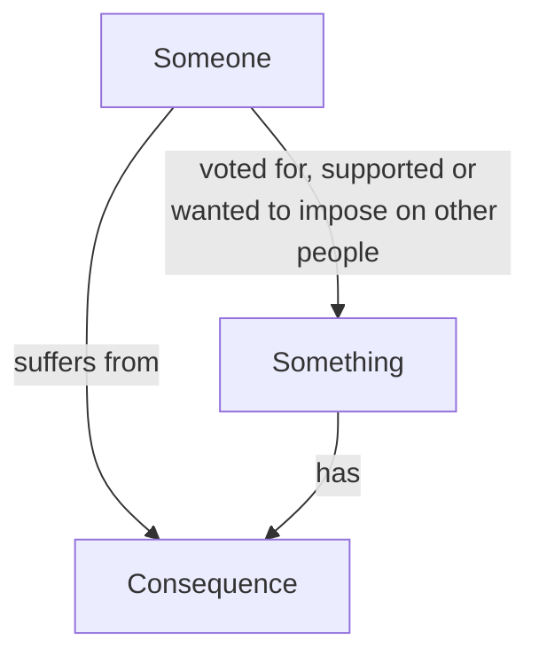
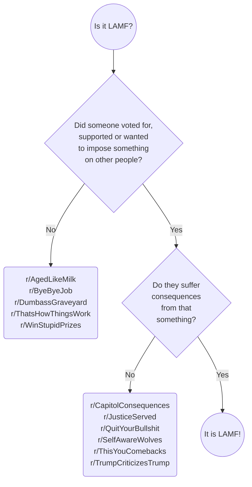

# FLAM

*Fierce LAMF Asking Machine* is intended to be a bot that requests explanatory comments under posts in [r/LeopardsAteMyFace](https://www.reddit.com/r/LeopardsAteMyFace).

It's not started yet.

## Theme

The "*leopards ate my face*" theme is embodied by this quote from the sidebar.

> "*I never thought leopards would eat **my** face*", sobs woman who voted for the *Leopards Eating People's Faces Party*. Revel in the schadenfreude anytime someone has a sad because they're suffering consequences from something they voted for, supported or wanted to impose on other people.

